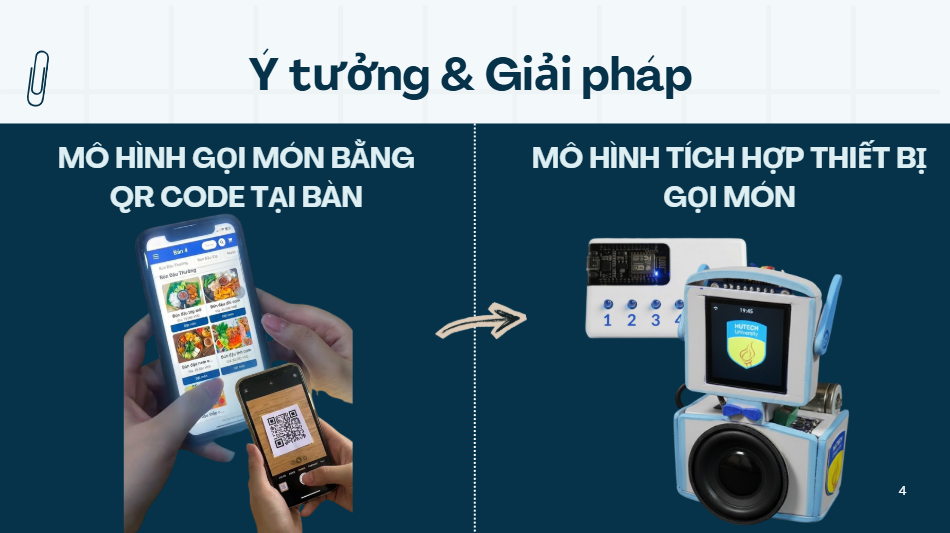
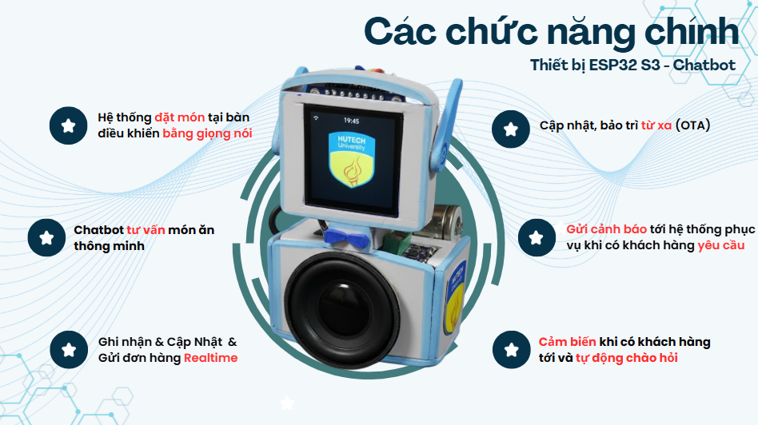
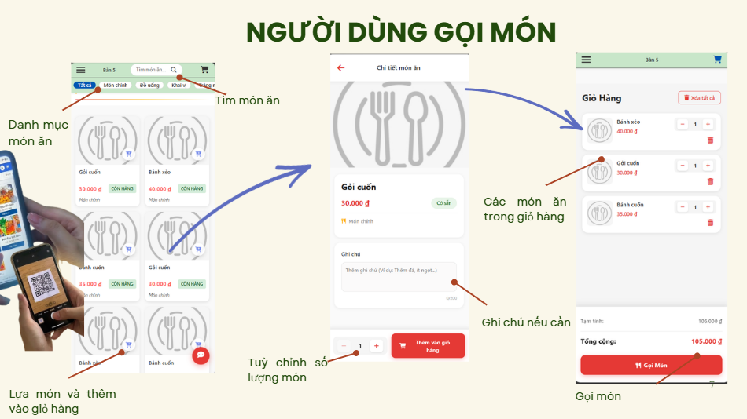
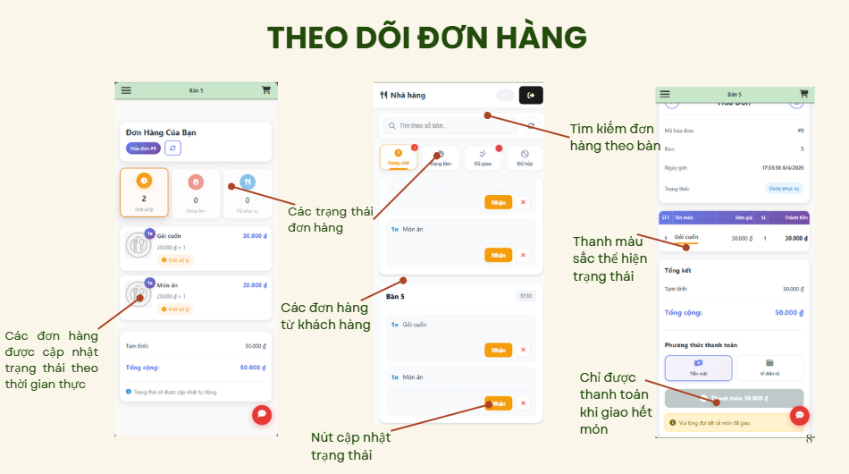
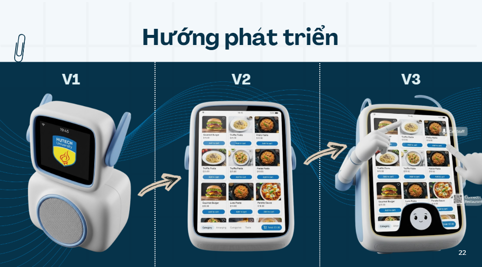

# 🚀 Hệ Thống Gọi Món Tại Bàn Thông Minh

## 1. 📌 Tổng quan

**Smart Table Ordering System** là giải pháp công nghệ dành cho nhà hàng, cho phép khách hàng gọi món trực tiếp tại bàn thông qua QR Code hoặc thiết bị IoT hỗ trợ giọng nói.

Hệ thống giúp:
- Tối ưu quy trình phục vụ
- Giảm tải cho nhân viên
- Nâng cao trải nghiệm khách hàng
- Tăng độ chính xác trong vận hành

---

## 2. ⚠️ Vấn đề

Quy trình gọi món truyền thống tồn tại nhiều hạn chế:

- ⏳ Khách hàng phải chờ nhân viên
- ❌ Dễ sai sót khi ghi order
- 🔄 Giao tiếp giữa bàn và bếp không hiệu quả
- 🚫 Không có cập nhật trạng thái real-time

---

## 3. 💡 Giải pháp



Hệ thống cung cấp:

- 📱 Gọi món qua QR Code tại bàn
- 🎙️ Gọi món bằng giọng nói (IoT + AI)
- ⚡ Đồng bộ đơn hàng real-time đến bếp
- 👨‍💼 Nhân viên theo dõi và xử lý đơn dễ dàng

---

## 4. ⭐ Tính năng chính

### 🤖 Thiết bị ESP32 S3 - Chatbot


### 🌐 Trang web gọi món tại bàn



### 🔥 Các chức năng nổi bật

- 📲 Gọi món bằng QR Code
- 🎤 Điều khiển bằng giọng nói (IoT + AI)
- ⚡ Cập nhật trạng thái real-time (WebSocket / Socket.io)
- 🔐 Xác thực & phân quyền (Admin / Employee)
- 🍽️ Quản lý menu & danh mục món
- 📊 Theo dõi trạng thái đơn hàng
- 🤖 Gọi món bằng AI (MCP)
- 💳 Tích hợp thanh toán online (MoMo)
- 🚨 Gửi tín hiệu cảnh báo khẩn cấp từ bàn

---

## 5. 🏗️ Kiến trúc hệ thống

Hệ thống gồm 3 thành phần chính:

### 🔧 Backend (Node.js)

- Xây dựng bằng **Node.js + Express.js**
- Thiết kế theo kiến trúc **RESTful API**
- Bảo mật bằng **JWT Authentication**
- Real-time communication với **Socket.io**
- Tích hợp thanh toán (MoMo)
- Tích hợp AI (MCP)

### 💻 Frontend

- Giao diện web cho khách hàng và nhân viên
- Dashboard quản lý cho admin
- Responsive UI (mobile-first)

### 📡 IoT

- Thiết bị **ESP32**
- Nhận lệnh giọng nói và gửi về hệ thống

---

## 6. 🛠️ Công nghệ sử dụng

### Backend
- Node.js
- Express.js
- JWT Authentication
- Socket.io (Real-time)

### Frontend
- ReactJS
- CSS Module / UI Components

### Database
- MySQL
- Sequelize ORM

### AI
- Model Context Protocol (MCP)
- LLM (DeepSeek)

### IoT
- ESP32 S3 N16R8

---

## 7. 🚀 Hướng phát triển



- 📊 Dashboard phân tích dữ liệu nâng cao
- 🌍 Hỗ trợ đa ngôn ngữ
- 📱 Phát triển mobile app
- 🤖 AI recommendation (gợi ý món ăn)
- 🔔 Notification thông minh

---

## 8. ⚙️ Hướng dẫn cài đặt

### Backend

```bash
cd backend
npm install
npm start
```

### Frontend

```bash
cd frontend
npm install
npm run dev
```

### MCP
```bash
cd mcp
pip install -r requirements.txt
python mcp_pipe.py
```